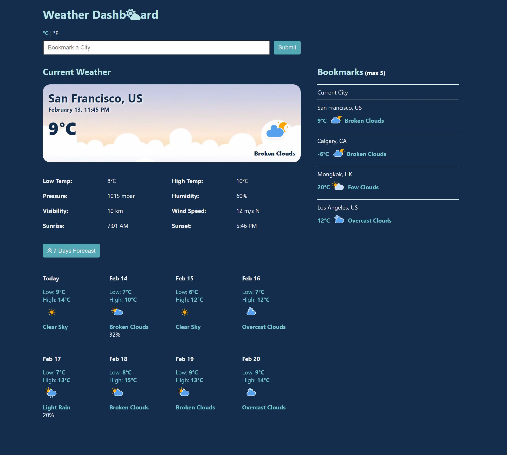

# Weather Dashboard
[Check it out here!](https://cw-weather.netlify.app/)

## Introduction

The Weather Dashboard is a single-page app that helps users plan their days by providing the latest weather information. It displays today's weather and weather forecasts for the next 7 days, based on the user's current location. Additionally, users can save other cities as bookmarks and view their weather information.

Users must give their browser permission to access their current location.

The technology stack used in this project includes React and TypeScript.

## Functionality

* View weather information at their current location in either metric or imperial units.
* Add cities to their bookmarks and view their weather information.
* Delete cities from their bookmarks.
* View more details by clicking on any of their bookmarked cities.
* View weather forecasts for their current city or any of their bookmarked cities.
* Their unit preferences and bookmarks are saved locally on their browser.

## Set Up

1. Make a new directory for this project
2. On your terminal, go to the directory that you just created

    `$ cd NAME_OF_DIRECTORY`

3. Git-clone and download the files from github:
    
    `$ git clone https://github.com/christysnwong/weather_typescript.git`

4. Install all the required programs by entering this on your terminal
    
    `$ npm install` 

5. To open the website on the local host (http://localhost:3000), type 
    
    `$ npm start`

## Screenshots

Homepage
