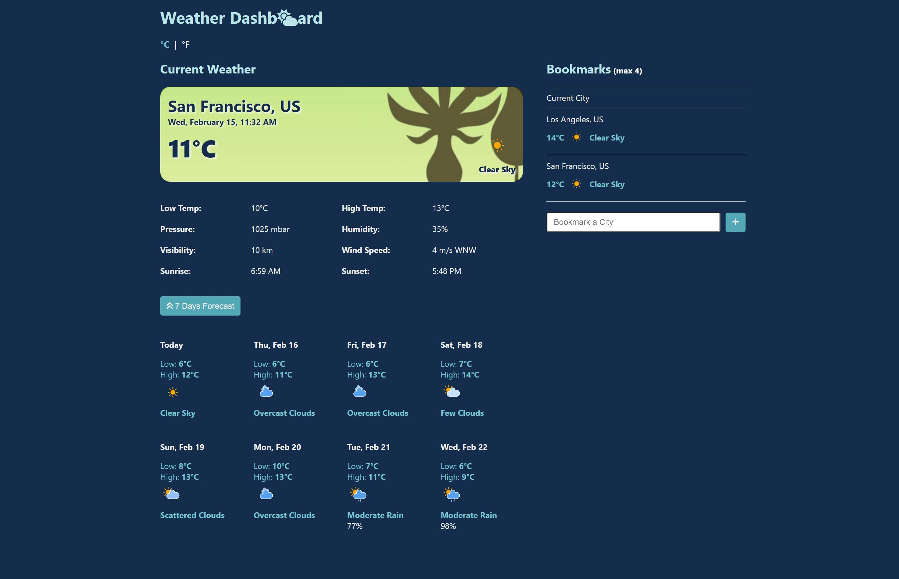

# Weather Dashboard
[Check it out here!](https://cw-weather.netlify.app/)

#### Introduction

Weather Dashboard is a single page app that allows users to get the latest weather information in order to plan their days. Users can view today's weather as well as weather forecasts for the next 7 days at their current location. Furthermore, users can bookmark other cities and find out weather information at other locations.

Users need to give permission to the browser to access their current location.

The tech stack of this project consists of React and Typescript.

#### Functionality

* Users can view the weather information at their current location in metric unit or imperial unit
* Users can add cities to their bookmarks and view cities' weather information
* Users can delete cities from their bookmarks
* Users can view more details by clicking on any bookmarked cities
* Users can view weather forecasts of their current city or bookmarked cities
* Users' unit preferences and bookmarks are saved locally on their browser

#### Set Up

1. Make a new directory for this project
2. On your terminal, go to the directory that you just created

    `$ cd NAME_OF_DIRECTORY`

3. Git-clone and download the files from github:
    
    `$ git clone https://github.com/christysnwong/weather_typescript.git`

4. Install all the required programs by entering this on your terminal
    
    `$ npm install` 

5. To open the website on the local host (http://localhost:3000), type 
    
    `$ npm start`

#### Screenshots

Homepage
